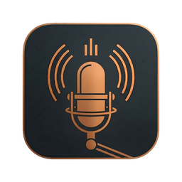

<div align="center">
  
  <h1>Siloquy</h1>
  <p>Personal macOS dictation app — on-device speech-to-text with local AI enhancement</p>

  [](https://www.gnu.org/licenses/gpl-3.0)
  
</div>

---

Siloquy is a personal fork of [VoiceInk](https://github.com/Beingpax/VoiceInk) by [Prakash Joshi Pax](https://github.com/Beingpax). It transcribes speech to text on-device using whisper.cpp / Parakeet models, then passes the result through a local AI model to clean up grammar and remove disfluencies — no cloud, no API keys.

Pre-built releases are available on the [Releases](https://github.com/vmlrodrigues/Siloquy/releases) page. Or build from source — see below.

## The name

**Siloquy** = *silicon* + *soliloquy* (with a nod to *silo*)

A speech you deliver to yourself, processed on local silicon, never leaving your machine. Triple meaning:

- **Silicon** — the hardware doing the work, entirely on-device
- **Soliloquy** — a speech addressed to no one else; what dictation really is
- **Silo** — data that stays contained, never shared with a cloud

Pronounced **SIL-oh-kwee** — like *soliloquy* with the *so-* swapped for *sil-*, landing the stress on the first syllable.

The logo concept: a single speech bubble drawn in circuit-board traces, floating in negative space.

## What's different from upstream VoiceInk

- App renamed to **Siloquy**, new icon, new bundle ID (`com.victorrodrigues.siloquy`)
- License requirement removed (always treated as licensed)
- Sparkle auto-update and all payment/affiliate links removed
- Attribution UI updated to credit original developer
- Local on-device AI enhancement via [LiteRT-LM](https://github.com/google-ai-edge/LiteRT-LM) — runs in-process via Metal, no API key or server required
- English variant setting (Australian / British / Canadian / American) in the enhancement gear panel

See [CHANGES.md](CHANGES.md) for the full diff from upstream.

## Building from source

Requires macOS 14.4+, Xcode, and an Apple Developer certificate in your keychain.

whisper.cpp is expected at `~/Code/opensource/whisper.cpp`. If the XCFramework is not already built, `make local` will clone and build it automatically (takes ~10 minutes the first time).

### Local development build

```bash
make local   # → ~/Downloads/Siloquy.app
```

Builds with ad-hoc signing then re-signs with your Apple Development certificate. macOS preserves Accessibility, Microphone, and Input Monitoring permissions across rebuilds because the code identity stays stable.

### Distribution build

```bash
make release VERSION=1.0.0
```

Builds with the Developer ID Application certificate, packages as a DMG, submits to Apple for notarisation, staples the ticket, and creates a GitHub Release with the DMG attached.

Requires one-time setup before first use:
- A **Developer ID Application** certificate installed in your keychain
- An **App Store Connect API key** stored as a named keychain profile (`siloquy-notarization`)
- `create-dmg` installed (`brew install create-dmg`)

See `holding/DISTRIBUTION_SETUP.md` for step-by-step instructions.

## Requirements

- macOS 14.4 or later
- Apple Silicon recommended (M-series) for on-device AI enhancement

## Acknowledgments

### Original Project
- [VoiceInk](https://github.com/Beingpax/VoiceInk) by [Prakash Joshi Pax](https://github.com/Beingpax) — the upstream app this fork is based on

### Core Technology
- [whisper.cpp](https://github.com/ggerganov/whisper.cpp) — high-performance inference of OpenAI's Whisper model
- [FluidAudio](https://github.com/FluidInference/FluidAudio) — Parakeet model implementation

### Dependencies
- [KeyboardShortcuts](https://github.com/sindresorhus/KeyboardShortcuts) — user-customizable keyboard shortcuts
- [LaunchAtLogin](https://github.com/sindresorhus/LaunchAtLogin-Modern) — launch at login functionality
- [MediaRemoteAdapter](https://github.com/ejbills/mediaremote-adapter) — media playback control during recording
- [Zip](https://github.com/marmelroy/Zip) — file compression utilities
- [SelectedTextKit](https://github.com/tisfeng/SelectedTextKit) — selected text capture
- [Swift Atomics](https://github.com/apple/swift-atomics) — thread-safe atomic operations

## License

GNU General Public License v3.0 — see [LICENSE](LICENSE). As a GPL v3 fork, this project must remain open source under the same license.
